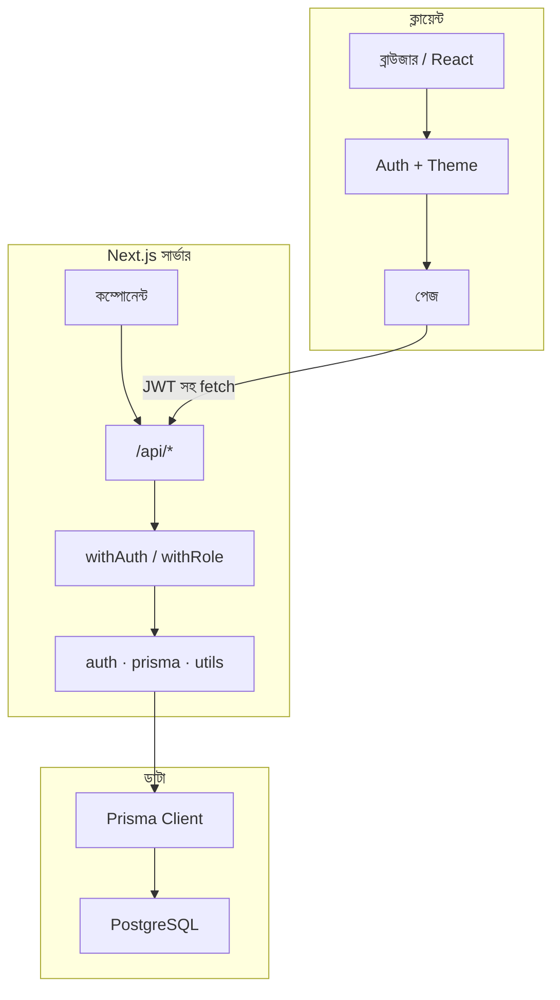
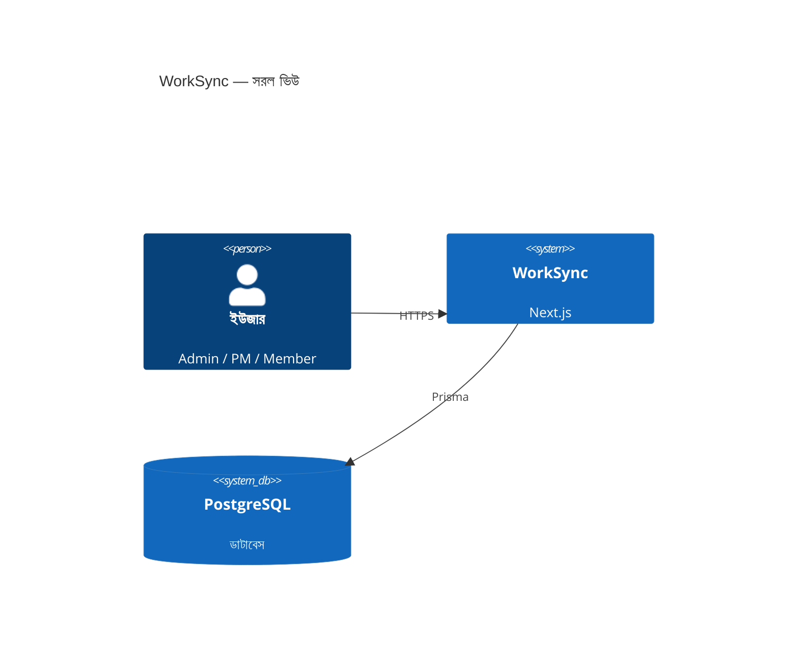
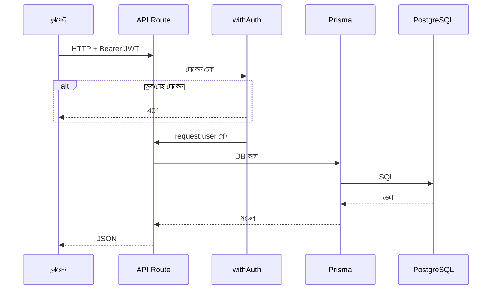
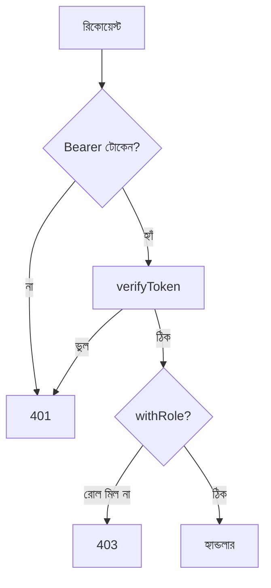
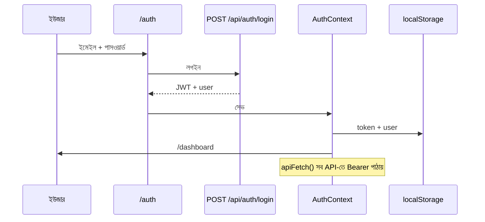
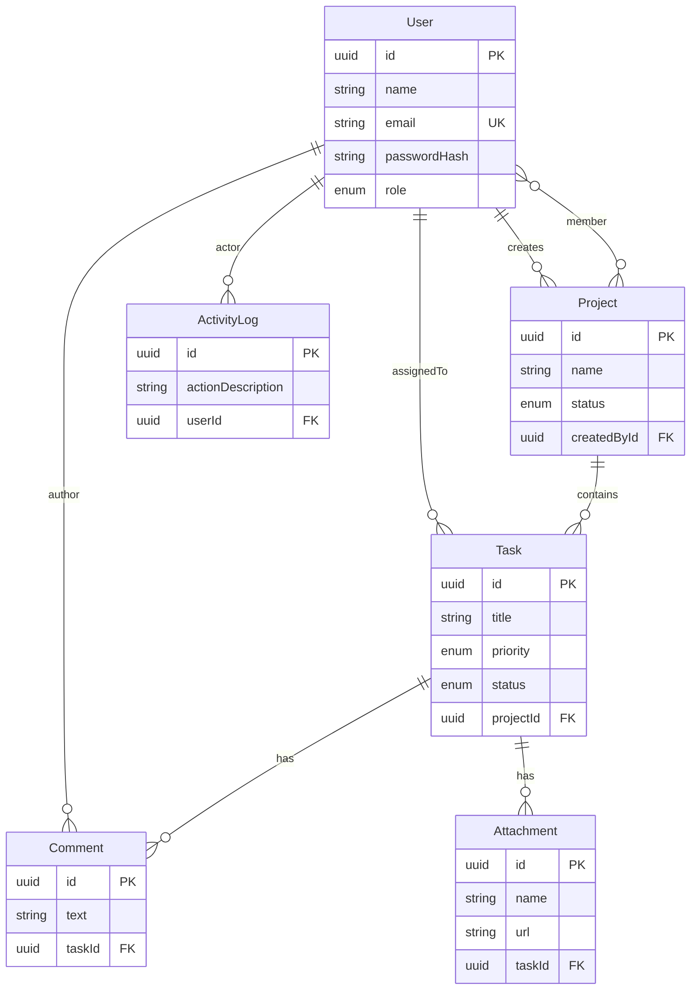
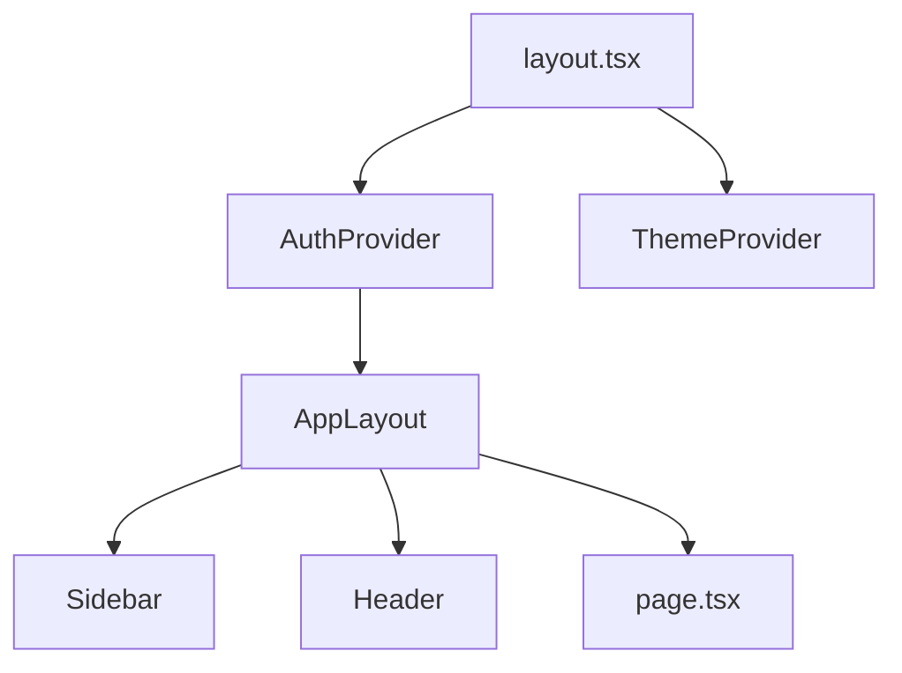

# WorkSync — প্রজেক্ট গাইড (বাংলা)

> **সব কিছু এক ফাইলে:** সিস্টেম ডিজাইন, রিকোয়ারমেন্ট, ডাটাবেস, API এবং ফিচার।  
> **সহজ বাংলায়** লেখা — ইংরেজি কঠিন লাগলে এই ফাইল পড়ুন।

| ভাষা | ফাইল |
|------|------|
| English | **[GUIDE.md](./GUIDE.md)** |
| বাংলা (এই ফাইল) | **GUIDE.bn.md** |

দ্রুত শুরু: [README.md](./README.md)

---

## সূচিপত্র

1. [প্রজেক্ট পরিচিতি](#1-প্রজেক্ট-পরিচিতি)
2. [ফাংশনাল রিকোয়ারমেন্ট](#2-ফাংশনাল-রিকোয়ারমেন্ট)
3. [নন-ফাংশনাল রিকোয়ারমেন্ট](#3-নন-ফাংশনাল-রিকোয়ারমেন্ট)
4. [যা যা আছে (ইমপ্লিমেন্টেড)](#4-যা-যা-আছে-ইমপ্লিমেন্টেড)
5. [সিস্টেম ডিজাইন](#5-সিস্টেম-ডিজাইন)
6. [হাই লেভেল ডিজাইন (HLD)](#6-হাই-লেভেল-ডিজাইন-hld)
7. [লো লেভেল ডিজাইন (LLD)](#7-লো-লেভেল-ডিজাইন-lld)
8. [ডাটাবেস ER ডায়াগ্রাম](#8-ডাটাবেস-er-ডায়াগ্রাম)
9. [ডাটাবেস ডিজাইন](#9-ডাটাবেস-ডিজাইন)
10. [API রেফারেন্স](#10-api-রেফারেন্স)
11. [সিকিউরিটি ও RBAC](#11-সিকিউরিটি-ও-rbac)
12. [ফ্রন্টএন্ড আর্কিটেকচার](#12-ফ্রন্টএন্ড-আর্কিটেকচার)
13. [Prisma ও PostgreSQL সেটআপ](#13-প্রিজমা-ও-পোস্টগ্রেসকিউএল-সেটআপ)
14. [ফোল্ডার স্ট্রাকচার](#14-ফোল্ডার-স্ট্রাকচার)
15. [ভবিষ্যৎ কাজ ও গ্যাপ](#15-ভবিষ্যৎ-কাজ-ও-গ্যাপ)

---

## 1. প্রজেক্ট পরিচিতি

**WorkSync** হলো একটি **প্রজেক্ট ও টাস্ক ম্যানেজমেন্ট** ওয়েব অ্যাপ। টিম একসাথে কাজ করতে পারে:

- প্রজেক্ট তৈরি ও ম্যানেজ
- টাস্ক অ্যাসাইন ও স্ট্যাটাস আপডেট
- কমেন্ট ও ফাইল অ্যাটাচমেন্ট
- অ্যাক্টিভিটি লগ (কে কী করল)

| বিষয় | মান |
|--------|-----|
| **নাম** | WorkSync |
| **টাইপ** | Next.js ওয়েব অ্যাপ |
| **ইউজার** | Admin, Project Manager, Team Member |
| **মূল ডেটা** | User, Project, Task, Comment, Attachment, ActivityLog |

---

## 2. ফাংশনাল রিকোয়ারমেন্ট

### 2.1 লগইন ও ইউজার

| ID | কাজ | স্ট্যাটাস |
|----|-----|----------|
| FR-A1 | নাম, ইমেইল, পাসওয়ার্ড দিয়ে রেজিস্টার | API ✅ / UI ✅ |
| FR-A2 | লগইন করে JWT পাওয়া | API ✅ / UI ✅ |
| FR-A3 | পাসওয়ার্ড bcrypt দিয়ে হ্যাশ | ✅ |
| FR-A4 | তিন রোল: `ADMIN`, `PROJECT_MANAGER`, `TEAM_MEMBER` | ✅ |
| FR-A5 | লগইন/রেজিস্টার অ্যাক্টিভিটি লগে যায় | ✅ |

### 2.2 প্রজেক্ট

| ID | কাজ | স্ট্যাটাস |
|----|-----|----------|
| FR-P1 | প্রজেক্ট তৈরি (নাম, বর্ণনা, ডেডলাইন, মেম্বার) | API ✅ |
| FR-P2 | পেজিনেশন সহ প্রজেক্ট লিস্ট | API ✅ |
| FR-P3 | এক প্রজেক্ট + টাস্ক + মেম্বার দেখা | API ✅ |
| FR-P4 | প্রজেক্ট আপডেট | API ✅ |
| FR-P5 | প্রজেক্ট ডিলিট (টাস্ক ক্যাসকেড) | API ✅ |
| FR-P6 | Admin সব দেখে; বাকিরা শুধু নিজের/মেম্বার প্রজেক্ট | ✅ |

### 2.3 টাস্ক

| ID | কাজ | স্ট্যাটাস |
|----|-----|----------|
| FR-T1 | প্রজেক্টে টাস্ক তৈরি, ইমেইল দিয়ে অ্যাসাইন | API ✅ |
| FR-T2 | রোল অনুযায়ী টাস্ক লিস্ট + পেজিনেশন | API ✅ |
| FR-T3 | টাস্ক আপডেট (রোল অনুযায়ী ফিল্ড সীমা) | API ✅ |
| FR-T4 | এক প্রজেক্টে একই টাইটেল দুইবার নয় (409) | ✅ |
| FR-T5 | অতীত ডেডলাইনে নতুন টাস্ক নয় | ✅ |
| FR-T6 | সম্পন্ন টাস্কে অ্যাসাইন বদলানো যায় না | ✅ |
| FR-T7 | টাস্ক মোডাল: কমেন্ট, অ্যাটাচমেন্ট প্রিভিউ | UI ✅ / API ✅ (`public/uploads`) |

### 2.4 কলাবোরেশন ও অডিট

| ID | কাজ | স্ট্যাটাস |
|----|-----|----------|
| FR-C1 | টাস্কে কমেন্ট যোগ/লিস্ট | API ✅ |
| FR-C2 | টাস্কে ফাইল অ্যাটাচমেন্ট | API ✅ |
| FR-C3 | বড় কাজের পর অ্যাক্টিভিটি লগ | API ✅ |
| FR-C4 | হেডারে নোটিফিকেশন | UI মক ডেটা ⚠️ |

### 2.5 ড্যাশবোর্ড ও অ্যানালিটিক্স

| ID | কাজ | স্ট্যাটাস |
|----|-----|----------|
| FR-D1 | KPI কার্ড | UI ✅ |
| FR-D2 | চার্ট (Recharts) | UI ✅ |
| FR-D3 | Analytics পেজ | UI ✅ |
| FR-D4 | Team পেজ | UI ✅ |
| FR-D5 | Activity পেজ | UI + API ✅ |

---

## 3. নন-ফাংশনাল রিকোয়ারমেন্ট

| ID | ধরন | চাহিদা | কীভাবে করা হয়েছে |
|----|------|--------|-------------------|
| NFR-1 | পারফরম্যান্স | API-তে `page`, `limit` | Tasks ও Projects |
| NFR-2 | সিকিউরিটি | JWT + RBAC | `withAuth`, `withRole` |
| NFR-3 | সিকিউরিটি | bcrypt পাসওয়ার্ড | `src/lib/auth.ts` |
| NFR-4 | নির্ভরযোগ্যতা | DB constraint, cascade | Prisma schema |
| NFR-5 | রক্ষণাবেক্ষণ | TypeScript | পুরো প্রজেক্ট |
| NFR-6 | UX | রেসপন্সিভ, থিম | ThemeContext |
| NFR-7 | UX | অ্যানিমেশন, glass UI | Framer Motion, CSS |
| NFR-8 | স্কেল | `pg` Pool | `src/lib/prisma.ts` |
| NFR-9 | ডিবাগ | Dev-এ Prisma query log | Prisma client |
| NFR-10 | ডিপ্লয় | build-এ `prisma generate` | `package.json` |

---

## 4. যা যা আছে (ইমপ্লিমেন্টেড)

### 4.1 পেজ (রাউট)

| রাউট | কাজ |
|------|-----|
| `/` | ল্যান্ডিং / রিডাইরেক্ট |
| `/auth` | লগইন ও রেজিস্টার |
| `/dashboard` | KPI, চার্ট, সাম্প্রতিক অ্যাক্টিভিটি |
| `/projects` | প্রজেক্ট গ্রিড |
| `/tasks` | টাস্ক লিস্ট, ফিল্টার, নতুন টাস্ক |
| `/team` | টিম মেম্বার |
| `/activity` | অ্যাক্টিভিটি টাইমলাইন |
| `/analytics` | এক্সট্রা মেট্রিক্স |

### 4.2 UI কম্পোনেন্ট

- **Sidebar** — মেনু, কলাপ্স
- **Header** — থিম, নোটিফিকেশন, প্রোফাইল
- **TaskDetailModal** — টাস্ক ডিটেইল, কমেন্ট, অ্যাটাচমেন্ট প্রিভিউ
- **AppLayout** — লগইন ছাড়া পেজের শেল

### 4.3 API (সংক্ষেপ)

| Method | Endpoint | Auth | রোল |
|--------|----------|------|------|
| POST | `/api/auth/register` | না | — |
| POST | `/api/auth/login` | না | — |
| GET | `/api/projects` | JWT | সব |
| POST | `/api/projects` | JWT | Admin, PM |
| GET/PUT/DELETE | `/api/projects/[id]` | JWT | স্কোপ অনুযায়ী |
| GET/POST | `/api/tasks` | JWT | স্কোপ অনুযায়ী |
| GET/PATCH | `/api/tasks/[id]` | JWT | রোল রুল |
| GET/POST | `/api/tasks/[id]/comments` | JWT | — |
| POST | `/api/tasks/[id]/attachments` | JWT | — |
| GET | `/api/activity` | JWT | — |
| GET | `/api/notifications` | JWT | — |

---

## 5. সিস্টেম ডিজাইন

তিন স্তর: **ব্রাউজার** → **Next.js (UI + API)** → **PostgreSQL**



### 5.1 মূল ধারণা

- **এক রিপো** — UI ও API একসাথে
- **JWT** — `Authorization: Bearer` হেডার
- **রোল অনুযায়ী ডেটা** — `userId` ও `role` দিয়ে ফিল্টার
- **অডিট** — বড় কাজে `ActivityLog`

---

## 6. হাই লেভেল ডিজাইন (HLD)

### 6.1 কনটেইনার ভিউ



### 6.2 লগইন সহ API রিকোয়েস্ট



### 6.3 মডিউল

| মডিউল | দায়িত্ব |
|--------|----------|
| `src/app/**/page.tsx` | UI, ফিল্টার, চার্ট |
| `src/app/api/**` | HTTP, ভ্যালিডেশন, RBAC |
| `src/lib/prisma.ts` | DB কানেকশন |
| `src/lib/middleware.ts` | Auth গার্ড |
| `src/lib/auth.ts` | bcrypt + JWT |
| `prisma/schema.prisma` | ডাটা মডেল |

---

## 7. লো লেভেল ডিজাইন (LLD)

### 7.1 Prisma ক্লায়েন্ট

- ফাইল: `src/lib/prisma.ts`
- Prisma 7 + `@prisma/adapter-pg`
- `DATABASE_URL` না থাকলে স্পষ্ট এরর

### 7.2 Auth মিডলওয়্যার



### 7.3 টাস্ক PATCH — রোল অনুযায়ী

| রোল | কী বদলাতে পারে | শর্ত |
|------|------------------|------|
| `TEAM_MEMBER` | শুধু `status` | টাস্ক নিজের উপর অ্যাসাইন |
| `PROJECT_MANAGER` | সব ফিল্ড | প্রজেক্টের মালিক বা মেম্বার |
| `ADMIN` | সব ফিল্ড | কোনো সীমা নেই |

### 7.4 ফ্রন্টএন্ড লগইন ফ্লো



---

## 8. ডাটাবেস ER ডায়াগ্রাম



**মেম্বার জয়েন টেবিল:** `_ProjectMembers` (Project ↔ User many-to-many)

---

## 9. ডাটাবেস ডিজাইন

### 9.1 Enum

| Enum | মান |
|------|-----|
| `Role` | ADMIN, PROJECT_MANAGER, TEAM_MEMBER |
| `ProjectStatus` | ACTIVE, COMPLETED, ON_HOLD |
| `TaskPriority` | HIGH, MEDIUM, LOW |
| `TaskStatus` | TODO, IN_PROGRESS, COMPLETED |

### 9.2 টেবিল (সংক্ষেপ)

| টেবিল | মূল কথা |
|-------|---------|
| `User` | `email` ইউনিক |
| `Project` | `createdById` → User |
| `Task` | `projectId` CASCADE |
| `Comment` | `taskId` CASCADE |
| `Attachment` | `taskId` CASCADE |
| `ActivityLog` | `userId` → User |

স্কিমা ফাইল: [`prisma/schema.prisma`](prisma/schema.prisma)

### 9.3 ভবিষ্যতে ইনডেক্স (আইডিয়া)

- `(projectId, title)` ইউনিক
- `ActivityLog` টাইমস্ট্যাম্প ইনডেক্স

---

## 10. API রেফারেন্স

### 10.1 প্রোটেক্টেড রাউট হেডার

```http
Authorization: Bearer <jwt>
```

### 10.2 রেজিস্টার

```http
POST /api/auth/register
Content-Type: application/json

{
  "name": "Alex Rivers",
  "email": "admin@worksync.io",
  "password": "admin123",
  "role": "ADMIN"
}
```

### 10.3 লগইন

```http
POST /api/auth/login
Content-Type: application/json

{
  "email": "admin@worksync.io",
  "password": "admin123"
}
```

### 10.4 টাস্ক লিস্ট (পেজিনেশন)

```http
GET /api/tasks?page=1&limit=10
Authorization: Bearer <token>
```

### 10.5 এরর ফরম্যাট

```json
{ "error": "মানুষের পড়ার মতো মেসেজ" }
```

সাধারণ কোড: `400`, `401`, `403`, `404`, `409`, `500`

---

## 11. সিকিউরিটি ও RBAC

### 11.1 রোল ম্যাট্রিক্স (সংক্ষেপ)

| কাজ | ADMIN | PM | MEMBER |
|-----|:-----:|:--:|:------:|
| সব প্রজেক্ট দেখা | ✅ | স্কোপ | স্কোপ |
| প্রজেক্ট তৈরি | ✅ | ✅ | ❌ |
| টাস্ক তৈরি | ✅ | ✅ | ❌ |
| টাস্কের সব ফিল্ড বদল | ✅ | ✅* | ❌ |
| শুধু স্ট্যাটাস বদল | ✅ | ✅ | ✅** |
| প্রজেক্ট ডিলিট | ✅ | নিজের | ❌ |

\* PM প্রজেক্টের মালিক/মেম্বার হতে হবে  
\** শুধু নিজের অ্যাসাইন টাস্ক

### 11.2 গোপন তথ্য (.env)

| ভেরিয়েবল | কাজ |
|-----------|-----|
| `DATABASE_URL` | PostgreSQL লিংক |
| `JWT_SECRET` | JWT সাইন (৭ দিন মেয়াদ) |

`.env` কখনো Git-এ দেবেন না — [.env.example](.env.example) দেখুন।

---

## 12. ফ্রন্টএন্ড আর্কিটেকচার



### 12.1 CSS টোকেন

`src/app/globals.css` — ডার্ক/লাইট, cyan/purple accent, `.glassmorphism`

### 12.2 লাইব্রেরি

| লাইব্রেরি | ব্যবহার |
|-----------|---------|
| Next.js 16 | রাউট, API |
| React 19 | UI |
| Framer Motion | অ্যানিমেশন |
| Recharts | চার্ট |
| React Hook Form + Zod | ফর্ম |
| Lucide | আইকন |

---

## 13. Prisma ও PostgreSQL সেটআপ

### 13.1 যা লাগবে

- Node.js 20+
- PostgreSQL 14+ (লোকাল বা রিমোট)

### 13.2 প্রথমবার সেটআপ

```bash
cp .env.example .env
# DATABASE_URL ও JWT_SECRET এডিট করুন

npm install
npm run db:migrate
npm run db:seed
npm run dev
```

### 13.3 NPM স্ক্রিপ্ট

| স্ক্রিপ্ট | কাজ |
|----------|-----|
| `db:generate` | Prisma client বানানো |
| `db:push` | স্কিমা DB-তে ঠেলা (মাইগ্রেশন ছাড়া) |
| `db:migrate` | মাইগ্রেশন |
| `db:studio` | DB GUI |
| `db:seed` | ডেমো ডেটা |
| `db:seed:reset` | সব মুছে আবার seed |

### 13.4 seed-এর পর ডেটা (আনুমানিক)

| এন্টিটি | সংখ্যা |
|---------|--------|
| Users | 8 |
| Projects | 4 |
| Tasks | 17 |
| Comments | 10 |
| Attachments | 8 |
| Activity logs | 20 |

ডেটা ফাইল: [`prisma/seed/data.mjs`](prisma/seed/data.mjs)

### 13.5 ডেমো অ্যাকাউন্ট

| ইমেইল | পাসওয়ার্ড | রোল |
|-------|-----------|------|
| `admin@worksync.io` | `admin123` | ADMIN |
| `manager@worksync.io` | `manager123` | PROJECT_MANAGER |
| `member@worksync.io` | `member123` | TEAM_MEMBER |

অন্যান্য: `kyle@worksync.io`, `john@worksync.io`, … — পাসওয়ার্ড: ইমেইলের আগের অংশ + `123` (যেমন `kyle123`)

### 13.6 Prisma 7 নোট

- URL: `prisma.config.ts`
- রানটাইম: `PrismaPg` + `pg.Pool` in `src/lib/prisma.ts`

### 13.7 অ্যাটাচমেন্ট ফাইল

আপলোড করা ফাইল যায়: `public/uploads/tasks/<taskId>/`  
URL: `/uploads/tasks/<taskId>/<filename>`

---

## 14. ফোল্ডার স্ট্রাকচার

```
worksync-full-stack/
├── prisma/
│   ├── schema.prisma
│   ├── seed.mjs
│   └── migrations/
├── prisma.config.ts
├── public/uploads/tasks/     # অ্যাটাচমেন্ট
├── src/
│   ├── app/
│   │   ├── api/
│   │   ├── auth/
│   │   ├── dashboard/
│   │   ├── projects/
│   │   ├── tasks/
│   │   ├── team/
│   │   ├── activity/
│   │   └── analytics/
│   ├── components/
│   ├── context/
│   └── lib/
├── .env.example
├── GUIDE.md                  # ইংরেজি গাইড
├── GUIDE.bn.md                 # এই ফাইল (বাংলা)
└── README.md
```

---

## 15. ভবিষ্যৎ কাজ ও গ্যাপ

| কাজ | অগ্রাধিকার | নোট |
|-----|------------|------|
| নোটিফিকেশন আসল ডেটা থেকে | মাঝারি | হেডারে এখন মক |
| অ্যাটাচমেন্ট S3/ক্লাউড | মাঝারি | এখন লোকাল `public/uploads` |
| WebSocket রিয়েলটাইম | কম | ঐচ্ছিক |
| E2E টেস্ট (Playwright) | কম | মেইন ফ্লো |

---

## দ্রুত লিংক

- [README — দ্রুত শুরু](README.md)
- [English guide (GUIDE.md)](./GUIDE.md)
- [Prisma Schema](prisma/schema.prisma)
- [.env.example](.env.example)

---

*আপডেট: জুন ২০২৬ · WorkSync v0.1.0*
