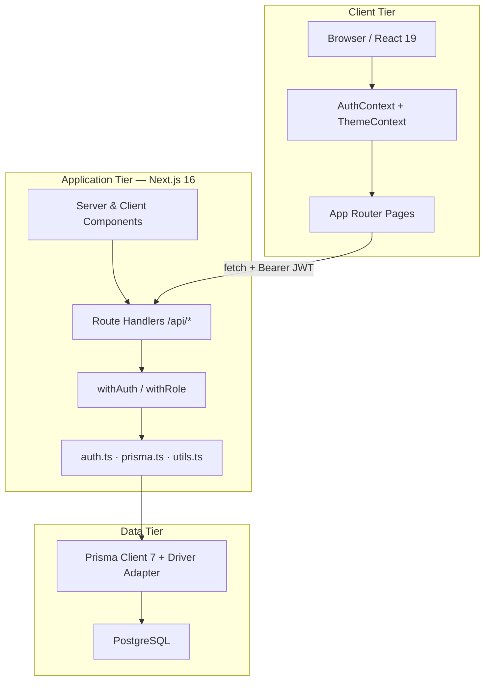
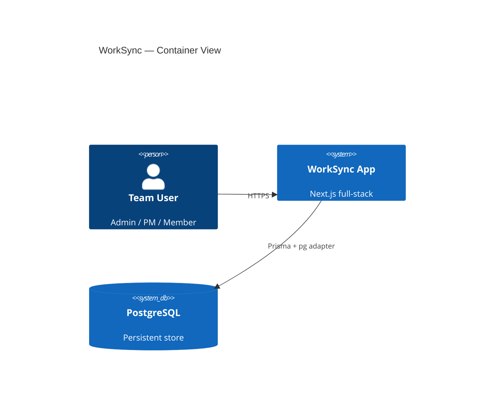
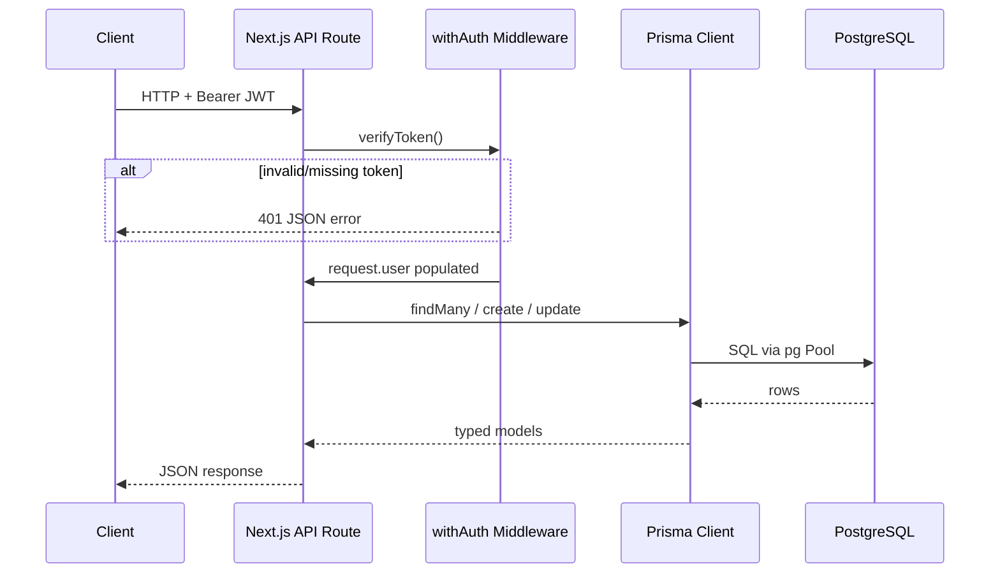
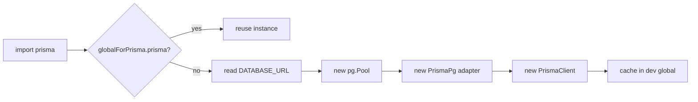
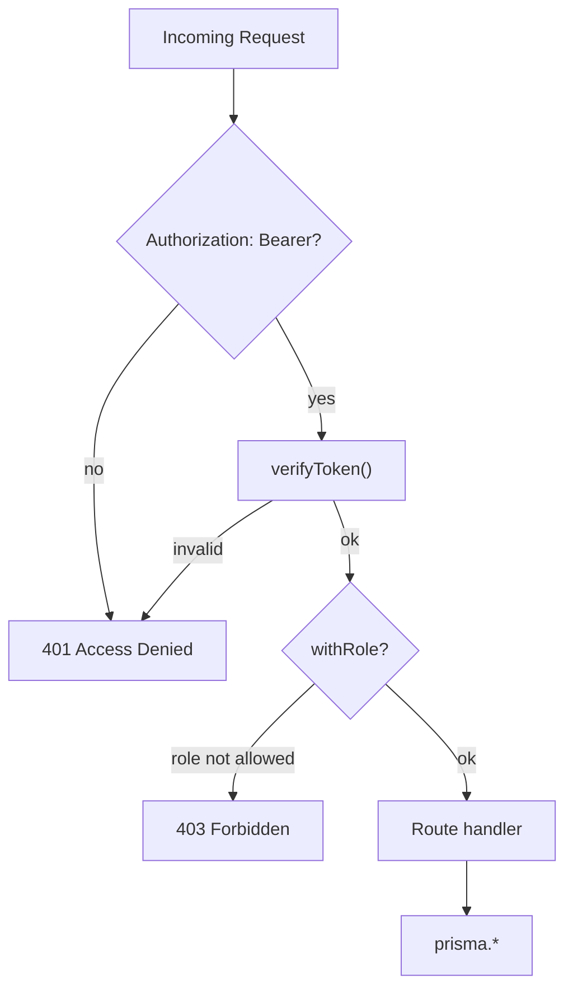
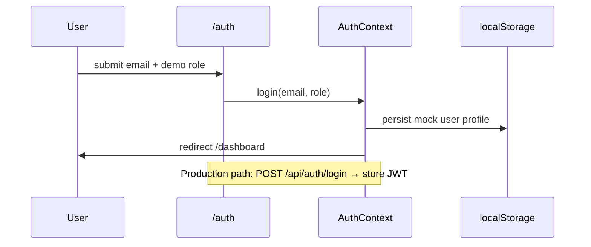
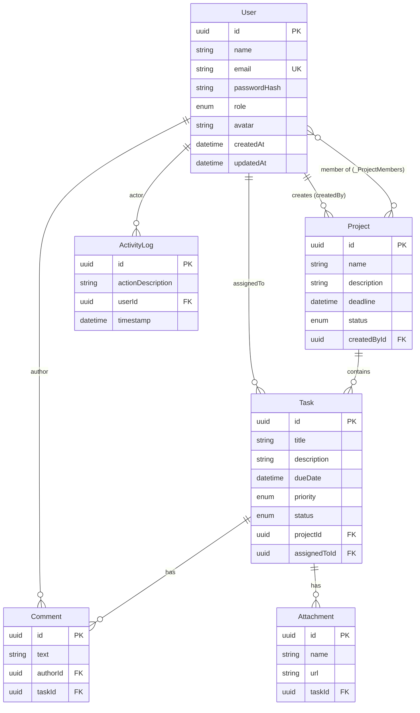
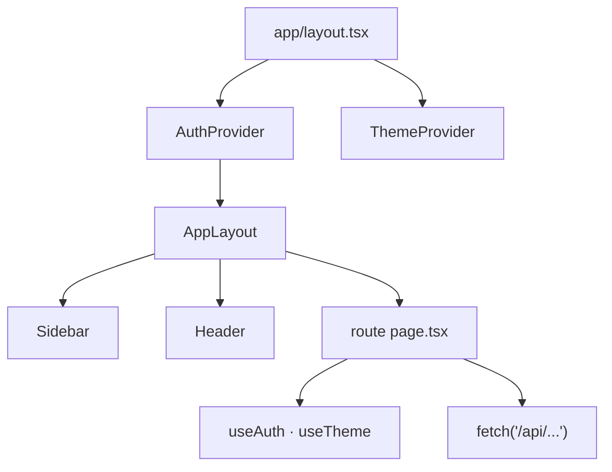

# WorkSync — Project Guide & Technical Documentation

> **পুরো সিস্টেম ডিজাইন, রিকোয়ারমেন্ট, ডাটাবেস, HLD/LLD এবং ফিচার লিস্ট এক জায়গায়।**  
> README থেকে এই ফাইলে লিংক করা আছে — GitHub/GitLab এ ক্লিক করলে নিচের সেকশনগুলো সরাসরি খুলে যাবে।

---

## Table of Contents

1. [Product Overview](#1-product-overview)
2. [Functional Requirements](#2-functional-requirements)
3. [Non-Functional Requirements](#3-non-functional-requirements)
4. [Features (Implemented)](#4-features-implemented)
5. [System Design](#5-system-design)
6. [High-Level Design (HLD)](#6-high-level-design-hld)
7. [Low-Level Design (LLD)](#7-low-level-design-lld)
8. [Entity Relationship Diagram](#8-entity-relationship-diagram)
9. [Database Design](#9-database-design)
10. [API Reference](#10-api-reference)
11. [Security & RBAC](#11-security--rbac)
12. [Frontend Architecture](#12-frontend-architecture)
13. [Prisma & PostgreSQL Setup](#13-prisma--postgresql-setup)
14. [Project Structure](#14-project-structure)
15. [Roadmap & Gaps](#15-roadmap--gaps)

---

## 1. Product Overview

**WorkSync** is a full-stack **project and task management dashboard** for teams. It combines a premium glassmorphic UI (dark/light themes), role-based access, REST APIs backed by **PostgreSQL + Prisma 7**, and analytics-oriented views.

| Attribute | Value |
|-----------|--------|
| **Name** | WorkSync |
| **Type** | Web application (SPA-style Next.js App Router) |
| **Primary users** | Admin, Project Manager, Team Member |
| **Core domains** | Users, Projects, Tasks, Comments, Attachments, Activity logs |

---

## 2. Functional Requirements

### 2.1 Authentication & Users

| ID | Requirement | Status |
|----|-------------|--------|
| FR-A1 | User can register with name, email, password | API ✅ / UI uses demo flow ⚠️ |
| FR-A2 | User can log in; server returns JWT | API ✅ |
| FR-A3 | Passwords stored as bcrypt hash | ✅ |
| FR-A4 | Roles: `ADMIN`, `PROJECT_MANAGER`, `TEAM_MEMBER` | ✅ |
| FR-A5 | Login/register events written to activity log | ✅ |

### 2.2 Projects

| ID | Requirement | Status |
|----|-------------|--------|
| FR-P1 | Create project (name, description, deadline, members) | API ✅ |
| FR-P2 | List projects with pagination | API ✅ |
| FR-P3 | View single project with tasks and members | API ✅ |
| FR-P4 | Update project (status, members, metadata) | API ✅ |
| FR-P5 | Delete project (cascade tasks) | API ✅ |
| FR-P6 | Admin sees all projects; others see owned/member projects | ✅ |

### 2.3 Tasks

| ID | Requirement | Status |
|----|-------------|--------|
| FR-T1 | Create task in project with assignee by email | API ✅ |
| FR-T2 | List tasks with pagination and role filtering | API ✅ |
| FR-T3 | Update task (full vs status-only by role) | API ✅ |
| FR-T4 | Duplicate title per project rejected (409) | ✅ |
| FR-T5 | Past deadline rejected on create | ✅ |
| FR-T6 | Completed tasks cannot be reassigned | ✅ |
| FR-T7 | Task detail modal: comments, attachments UI | UI ✅ / API partial |

### 2.4 Collaboration & Audit

| ID | Requirement | Status |
|----|-------------|--------|
| FR-C1 | Add/list comments on a task | API ✅ |
| FR-C2 | Add attachment metadata on a task | API ✅ |
| FR-C3 | Activity log for major actions | API ✅ |
| FR-C4 | Notification center in header | UI mock data ⚠️ |

### 2.5 Dashboard & Analytics

| ID | Requirement | Status |
|----|-------------|--------|
| FR-D1 | KPI cards (projects, tasks, overdue) | UI ✅ (mock fallback) |
| FR-D2 | Charts: distribution, trend, workload | Recharts ✅ |
| FR-D3 | Dedicated Analytics page | UI ✅ |
| FR-D4 | Team roster page | UI ✅ |
| FR-D5 | Activity log page | UI + API ✅ |

---

## 3. Non-Functional Requirements

| ID | Category | Requirement | How addressed |
|----|----------|-------------|---------------|
| NFR-1 | **Performance** | Paginated list APIs (`page`, `limit`) | Tasks & Projects routes |
| NFR-2 | **Security** | JWT on protected routes; RBAC middleware | `withAuth`, `withRole` |
| NFR-3 | **Security** | Password hashing (bcrypt, salt 10) | `src/lib/auth.ts` |
| NFR-4 | **Reliability** | DB constraints, cascades on task delete | Prisma schema |
| NFR-5 | **Maintainability** | TypeScript end-to-end | `tsconfig.json` |
| NFR-6 | **UX** | Responsive layout, theme toggle | `ThemeContext`, Tailwind v4 |
| NFR-7 | **UX** | Motion and glassmorphism | Framer Motion, CSS tokens |
| NFR-8 | **Scalability** | Connection pooling via `pg` Pool | `src/lib/prisma.ts` |
| NFR-9 | **Observability** | Prisma query logs in development | Prisma client `log` option |
| NFR-10 | **Deployability** | `prisma generate` on build/postinstall | `package.json` scripts |

---

## 4. Features (Implemented)

### 4.1 Application Pages

| Route | Purpose |
|-------|---------|
| `/` | Landing redirect |
| `/auth` | Login / register UI (demo role picker + optional API) |
| `/dashboard` | KPIs, charts, recent activity |
| `/projects` | Project grid and management |
| `/tasks` | Task board, filters, infinite load, create modal |
| `/team` | Team member overview |
| `/activity` | Activity timeline |
| `/analytics` | Extended metrics and charts |

### 4.2 UI Components

- **Sidebar** — collapsible navigation with active indicator
- **Header** — theme toggle, notifications dropdown, profile menu
- **TaskDetailModal** — task details, status, comments, attachment preview
- **AppLayout** — wraps authenticated shell

### 4.3 Backend (API Routes)

| Method | Endpoint | Auth | Roles |
|--------|----------|------|-------|
| POST | `/api/auth/register` | Public | — |
| POST | `/api/auth/login` | Public | — |
| GET | `/api/projects` | JWT | All |
| POST | `/api/projects` | JWT | Admin, PM |
| GET | `/api/projects/[id]` | JWT | Member scope |
| PUT | `/api/projects/[id]` | JWT | Admin, PM |
| DELETE | `/api/projects/[id]` | JWT | Admin, PM |
| GET | `/api/tasks` | JWT | All (scoped) |
| POST | `/api/tasks` | JWT | Admin, PM |
| PATCH | `/api/tasks/[id]` | JWT | Role rules |
| GET | `/api/tasks/[id]/comments` | JWT | — |
| POST | `/api/tasks/[id]/comments` | JWT | — |
| POST | `/api/tasks/[id]/attachments` | JWT | — |
| GET | `/api/activity` | JWT | — |
| GET | `/api/notifications` | JWT | Activity-based |

---

## 5. System Design

WorkSync follows a **classic three-tier web architecture**: browser client → Next.js server (UI + API) → PostgreSQL.



### 5.1 Design principles

- **Single codebase** — UI and API in one Next.js repo
- **Stateless API auth** — JWT in `Authorization: Bearer` header
- **Role-scoped data** — queries filtered by `userId` and `role`
- **Audit trail** — `ActivityLog` on mutations and login

---

## 6. High-Level Design (HLD)

### 6.1 Container diagram



### 6.2 Request lifecycle (authenticated API)



### 6.3 Module boundaries

| Module | Responsibility |
|--------|----------------|
| `src/app/**/page.tsx` | Presentation, filters, charts |
| `src/app/api/**` | HTTP contract, validation, RBAC |
| `src/lib/prisma.ts` | DB singleton with adapter |
| `src/lib/middleware.ts` | Auth guards |
| `src/lib/auth.ts` | bcrypt + JWT |
| `prisma/schema.prisma` | Canonical data model |

---

## 7. Low-Level Design (LLD)

### 7.1 Prisma client initialization



**File:** `src/lib/prisma.ts`  
- Uses `@prisma/adapter-pg` (required in Prisma 7 for direct TCP)  
- Throws clear error if `DATABASE_URL` missing at runtime  

### 7.2 Auth middleware chain



### 7.3 Task PATCH authorization (LLD)

| Role | Allowed fields | Preconditions |
|------|----------------|---------------|
| `TEAM_MEMBER` | `status` only | `assignedToId === userId` |
| `PROJECT_MANAGER` | All fields | Owns or is member of parent project |
| `ADMIN` | All fields | None |

### 7.4 Task list query (non-admin)

```typescript
// Conceptual where clause (see src/app/api/tasks/route.ts)
OR: [
  { assignedToId: userId },
  { project: { OR: [
      { createdById: userId },
      { members: { some: { id: userId } } }
  ]}}
]
```

### 7.5 Frontend auth flow (current)



> **Note:** API login/register are production-ready; `AuthContext` still uses a demo localStorage flow. Wire the UI to `/api/auth/login` to complete end-to-end auth.

---

## 8. Entity Relationship Diagram



### 8.1 Implicit join table

Prisma many-to-many `Project.members` ↔ `User.memberProjects` maps to:

**`_ProjectMembers`** (`A` = Project.id, `B` = User.id)

---

## 9. Database Design

### 9.1 Enums

| Enum | Values |
|------|--------|
| `Role` | `ADMIN`, `PROJECT_MANAGER`, `TEAM_MEMBER` |
| `ProjectStatus` | `ACTIVE`, `COMPLETED`, `ON_HOLD` |
| `TaskPriority` | `HIGH`, `MEDIUM`, `LOW` |
| `TaskStatus` | `TODO`, `IN_PROGRESS`, `COMPLETED` |

### 9.2 Tables summary

| Table | PK | Notable constraints |
|-------|-----|---------------------|
| `User` | `id` | `email` UNIQUE |
| `Project` | `id` | FK `createdById` → User |
| `Task` | `id` | FK `projectId` CASCADE; optional `assignedToId` |
| `Comment` | `id` | FK `taskId` CASCADE |
| `Attachment` | `id` | FK `taskId` CASCADE |
| `ActivityLog` | `id` | FK `userId` → User |
| `_ProjectMembers` | (`A`,`B`) | M2M bridge |

### 9.3 Schema source

Canonical definition: [`prisma/schema.prisma`](prisma/schema.prisma)  
Initial migration: [`prisma/migrations/20250604000000_init/migration.sql`](prisma/migrations/20250604000000_init/migration.sql)

### 9.4 Indexing recommendations (future)

- `(projectId, title)` unique composite for duplicate-title rule at DB level
- `ActivityLog(userId, timestamp DESC)` for feed queries
- `Task(assignedToId, status)` for dashboard filters

---

## 10. API Reference

### 10.1 Authentication header

```http
Authorization: Bearer <jwt>
```

### 10.2 Register

```http
POST /api/auth/register
Content-Type: application/json

{
  "name": "Alex Rivers",
  "email": "admin@worksync.io",
  "password": "admin123",
  "role": "ADMIN"
}
```

### 10.3 Login

```http
POST /api/auth/login
Content-Type: application/json

{
  "email": "admin@worksync.io",
  "password": "admin123"
}
```

### 10.4 Tasks (paginated)

```http
GET /api/tasks?page=1&limit=10
Authorization: Bearer <token>
```

### 10.5 Standard error shape

```json
{ "error": "Human-readable message" }
```

Common status codes: `400`, `401`, `403`, `404`, `409`, `500`

---

## 11. Security & RBAC

### 11.1 Role matrix (simplified)

| Action | ADMIN | PROJECT_MANAGER | TEAM_MEMBER |
|--------|:-----:|:---------------:|:-----------:|
| View all projects | ✅ | scoped | scoped |
| Create project | ✅ | ✅ | ❌ |
| Create task | ✅ | ✅ | ❌ |
| Update any task field | ✅ | ✅* | ❌ |
| Update task status | ✅ | ✅ | ✅** |
| Delete project | ✅ | own only | ❌ |

\* PM must own or belong to the project  
\** Only on tasks assigned to them

### 11.2 Secrets

| Variable | Purpose |
|----------|---------|
| `DATABASE_URL` | PostgreSQL connection string |
| `JWT_SECRET` | Signs access tokens (7-day expiry) |

Never commit `.env` — use [`.env.example`](.env.example).

---

## 12. Frontend Architecture



### 12.1 Design tokens (CSS)

Defined in `src/app/globals.css`:

- Dark base `#0a0a0a`
- Accents: cyan `#00f2fe`, purple, emerald
- Utility: `.glassmorphism` (blur + transparency)

### 12.2 Key libraries

| Library | Use |
|---------|-----|
| Next.js 16 | App Router, API routes |
| React 19 | UI |
| Framer Motion | Layout animations |
| Recharts | Dashboard charts |
| React Hook Form + Zod | Task create form |
| Lucide React | Icons |

---

## 13. Prisma & PostgreSQL Setup

### 13.1 Prerequisites

- Node.js 20+
- PostgreSQL 14+ running locally or remote

### 13.2 First-time setup

```bash
cp .env.example .env
# Edit DATABASE_URL and JWT_SECRET in .env

npm install
npm run db:migrate    # apply migrations (or: npm run db:push)
npm run db:seed       # full seed (8 users, 4 projects, 17 tasks, comments, attachments, logs)
npm run db:seed:reset # wipe all tables then seed
npm run dev
```

### 13.3 NPM scripts

| Script | Command | Description |
|--------|---------|-------------|
| `postinstall` | `prisma generate` | Client after install |
| `db:generate` | `prisma generate` | Regenerate client |
| `db:push` | `prisma db push` | Sync schema without migration files |
| `db:migrate` | `prisma migrate dev` | Dev migrations |
| `db:studio` | `prisma studio` | DB GUI |
| `db:seed` | `node prisma/seed.mjs` | Upsert full demo dataset |
| `db:seed:reset` | `node prisma/seed.mjs --reset` | Clear DB then seed |

### 13.4 Seed data (after `db:seed`)

| Entity | Count |
|--------|------:|
| Users | 8 (1 Admin, 2 PM, 5 Members) |
| Projects | 4 (2 Active, 1 On Hold, 1 Completed) |
| Tasks | 17 |
| Comments | 10 |
| Attachments | 8 |
| Activity logs | 20 |

Data definitions: [`prisma/seed/data.mjs`](prisma/seed/data.mjs)

### 13.5 Demo accounts (primary)

| Email | Password | Role |
|-------|----------|------|
| `admin@worksync.io` | `admin123` | ADMIN |
| `manager@worksync.io` | `manager123` | PROJECT_MANAGER |
| `member@worksync.io` | `member123` | TEAM_MEMBER |

Additional: `kyle@worksync.io`, `john@worksync.io`, `emma@worksync.io`, `priya@worksync.io`, `demo@worksync.io` (password = local-part + `123`, e.g. `kyle123`).

### 13.6 Prisma 7 configuration

- Connection URL: `prisma.config.ts` (not in `schema.prisma` datasource block)
- Runtime adapter: `PrismaPg` + `pg.Pool` in `src/lib/prisma.ts`
- Config loads env via `dotenv/config`

---

## 14. Project Structure

```
worksync-full-stack/
├── prisma/
│   ├── schema.prisma          # Data model
│   ├── seed.mjs               # Demo data
│   └── migrations/            # SQL migrations
├── prisma.config.ts           # Prisma 7 datasource URL
├── src/
│   ├── app/
│   │   ├── api/               # REST handlers
│   │   ├── auth/              # Login page
│   │   ├── dashboard/
│   │   ├── projects/
│   │   ├── tasks/
│   │   ├── team/
│   │   ├── activity/
│   │   └── analytics/
│   ├── components/            # Sidebar, Header, Modal, Layout
│   ├── context/               # Auth, Theme
│   └── lib/                   # prisma, auth, middleware, utils
├── .env.example
├── GUIDE.md                   # ← You are here
└── README.md                  # Quick start + link to this guide
```

---

## 15. Roadmap & Gaps

| Item | Priority | Notes |
|------|----------|-------|
| Connect `AuthContext` to `/api/auth/login` | High | Store JWT in localStorage/session |
| Send `Authorization` header from task pages | High | Tasks fetch currently unauthenticated |
| Real notifications from `ActivityLog` | Medium | Replace header mock array |
| File upload to S3/Cloudinary | Medium | Attachments store URL only |
| WebSocket real-time updates | Low | Optional enhancement |
| E2E tests (Playwright) | Low | API + critical flows |

---

## Quick links

- [README — Getting Started](README.md)
- [Prisma Schema](prisma/schema.prisma)
- [Environment template](.env.example)

---

*Last updated: June 2026 · WorkSync v0.1.0*
